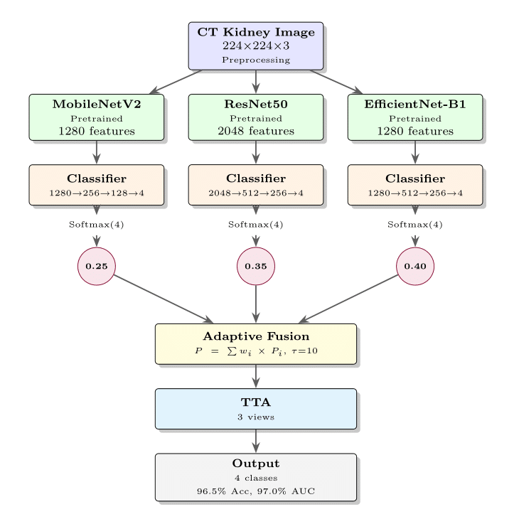

# Kidney-XAI: Explainable AI for Kidney Disease Classification

[](https://www.python.org/downloads/)
[](https://pytorch.org/)
[](https://opensource.org/licenses/MIT)

Deep learning ensemble framework for automated kidney disease classification from CT scans with explainable AI visualizations using GradCAM and LIME.

## Overview

Kidney-XAI implements an ensemble of deep learning models (MobileNetV2, ResNet50, EfficientNet-B1) for multi-class kidney disease classification. The framework provides interpretable predictions through gradient-based and perturbation-based explainability techniques.

### Architecture

<p align="center">
  
</p>

*Figure: Ensemble architecture combining MobileNetV2, ResNet50, and EfficientNet-B1 with dynamic weighting and explainability modules.*

## Dataset

The model classifies kidney CT scans into four categories:
- **Cyst**: Fluid-filled sacs in the kidney
- **Normal**: Healthy kidney tissue
- **Stone**: Kidney stones (nephrolithiasis)
- **Tumor**: Abnormal tissue growth

### Dataset Structure

```
data/
├── Cyst/
│   ├── image_001.jpg
│   └── ...
├── Normal/
│   ├── image_001.jpg
│   └── ...
├── Stone/
│   ├── image_001.jpg
│   └── ...
└── Tumor/
    ├── image_001.jpg
    └── ...
```

## Installation

### Requirements

- Python 3.8+
- PyTorch 2.0+
- CUDA 11.0+ (for GPU training)

### Setup

```bash
git clone https://github.com/darrinbright/Kidney-XAI.git
cd Kidney-XAI

conda create -n kidney-xai python=3.8
conda activate kidney-xai

pip install -r requirements.txt
```

## Usage

### Training

```bash
python train.py --data_dir ./data --epochs 25 --batch_size 32
```

### Training Options

```bash
python train.py \
  --data_dir ./data \
  --epochs 25 \
  --batch_size 32 \
  --lr_mobilenet 8e-5 \
  --lr_resnet 4e-5 \
  --lr_efficientnet 1.5e-4 \
  --weight_decay 5e-4 \
  --focal_gamma 2.0 \
  --label_smoothing 0.1 \
  --patience 5 \
  --save_dir ./checkpoints
```

### Key Hyperparameters

| Parameter | Default | Description |
|-----------|---------|-------------|
| `--epochs` | 25 | Number of training epochs |
| `--batch_size` | 32 | Batch size for training |
| `--focal_gamma` | 2.0 | Focal loss gamma parameter |
| `--label_smoothing` | 0.1 | Label smoothing factor |
| `--patience` | 5 | Early stopping patience |

## Model Architecture

### Ensemble Components

1. **MobileNetV2**: Lightweight architecture for efficient inference
2. **ResNet50**: Deep residual network for robust feature extraction
3. **EfficientNet-B1**: Compound scaling for optimal accuracy-efficiency trade-off

### Custom Modifications

- Multi-layer classifier heads with batch normalization and dropout
- Dynamic ensemble weighting based on validation performance
- Focal loss with class-specific weights for imbalanced data

## Explainability

### GradCAM Visualization

Gradient-weighted Class Activation Mapping highlights discriminative regions:

```python
# GradCAM is automatically generated during training
# Visualizations saved to ./results/GradCAM/
```

### LIME Explanation

Local Interpretable Model-agnostic Explanations for prediction understanding:

```python
# LIME visualizations saved to ./results/LIME/
```

## Project Structure

```
Kidney-XAI/
├── train.py                 # Main training script
├── requirements.txt         # Python dependencies
├── README.md               # Documentation
├── .gitignore              # Git ignore rules
├── data/                   # Dataset directory
├── checkpoints/            # Saved models
└── results/                # Outputs and visualizations
    ├── GradCAM/
    ├── LIME/
    ├── ConfusionMatrix/
    ├── ROC/
    └── TrainingValidation/
```

## Technical Details

### Training Strategy

- **Optimizer**: AdamW with model-specific learning rates
- **Scheduler**: Linear warmup (5 epochs) + ReduceLROnPlateau
- **Loss Function**: Focal Loss with label smoothing
- **Mixed Precision**: Automatic mixed precision (AMP) for faster training
- **Gradient Clipping**: Max norm of 0.3 to prevent exploding gradients
- **Gradient Accumulation**: 2 steps for effective larger batch size

### Data Processing

- **Train Split**: 70% with class balancing
- **Validation Split**: 15%
- **Test Split**: 15%
- **Image Size**: 224×224 pixels
- **Normalization**: ImageNet statistics
- **Augmentation**: Random crops, flips, rotations, color jitter, random erasing

## Citation

If you use this code in your research, please cite:

```bibtex
@software{kidney_xai_2026,
  title={Kidney-XAI: Explainable AI for Kidney Disease Classification},
  author={Darrin Bright},
  year={2026},
  url={https://github.com/darrinbright/Kidney-XAI}
}
```

## License

This project is licensed under the MIT License - see the LICENSE file for details.

## Contact

For questions or collaborations, please contact: darrin.bright2022@vitstudent.ac.in
